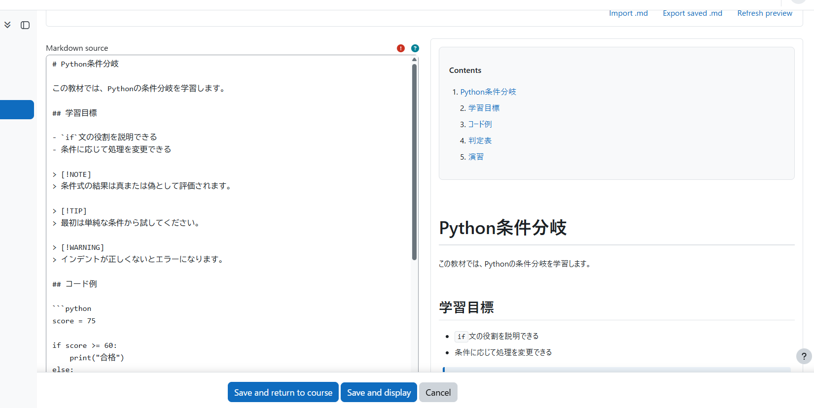

# LessonMark

[](https://github.com/ozekihiroshi/LessonMark/actions/workflows/moodle-plugin-ci.yml)
[](LICENSE)

LessonMark is a Moodle course resource for authoring, previewing, and
publishing teaching material whose source of truth remains Markdown.

The plugin component is `mod_lessonmark`. Stable release 0.1.0 targets Moodle
5.2 on PHP 8.3 and 8.4.



Teachers can create a resource entirely in Moodle, import or export a `.md`
source file, manage images through Moodle's File API, and preview the same
sanitised result students will see.

## Repository layout

```text
LessonMark/
├── .github/workflows/     GitHub Actions quality and release gates
├── docs/                  Product, technical, user, and release records
├── plugin/lessonmark/     Installable mod_lessonmark source
├── scripts/               Release, smoke, and local CI runners
└── LessonMark.code-workspace
```

Reusable Moodle Docker environments remain in the separate
`moodle-rescue` development repository. The UI upload environment contains no
LessonMark source mount and can exercise the real ZIP install lifecycle.

## WSL workflow

```sh
cd /mnt/d/workspace/LessonMark
scripts/run-ci-local.sh
scripts/build-release.sh
php scripts/verify-release.php 0.1.0 build/mod_lessonmark.zip
```

The local CI runner creates and removes only its own temporary Docker network,
database container, and PHP test container. It runs the Moodle PHP gates,
Grunt JavaScript/CSS checks, AMD generation consistency, and PHPUnit. Select a
supported PHP version with `LESSONMARK_CI_PHP_VERSION=8.4`. An informational
Moodle development-branch probe can be run with
`LESSONMARK_CI_MOODLE_BRANCH=main`; it is not a production support claim.

The release artifact is written to `build/mod_lessonmark.zip`. The builder
requires a clean Git worktree, archives only committed plugin files, validates
the ZIP layout, and produces byte-identical output for the same commit.

## Current status

M1 through M7 are implemented. LessonMark provides Markdown source storage, a
responsive Edit/Preview authoring surface, shared safe preview and student
rendering, teaching-document presentation, Moodle File API images, `.md`
import/export, and complete activity backup/restore and duplicate behavior.

M7 adds release metadata, keyboard and screen-reader editor behavior,
Behat acceptance/accessibility coverage, security and privacy regression tests,
expanded static analysis, package inspection, and install/release operations.
Release 0.1.0 completed the supported-matrix CI, upload lifecycle,
reproducibility, and GitHub Actions gates for the same source commit.

## Documents

- [Product requirements](docs/PRODUCT_REQUIREMENTS.md)
- [Technical decisions and milestones](docs/TECHNICAL_DECISIONS.md)
- [Authoring guide](docs/AUTHORING_GUIDE.md)
- [Installation and upgrade](docs/INSTALLATION.md)
- [Release checklist](docs/RELEASE_CHECKLIST.md)
- [Security policy](SECURITY.md)
- [Marketplace listing copy](docs/MARKETPLACE_LISTING.md)
- [Publication audit](docs/PUBLICATION_AUDIT.md)
- [Contributing](CONTRIBUTING.md)
- [M7 implementation result](docs/M7_IMPLEMENTATION.md)
- [Documentation index](docs/README.md)

## GitHub

The repository is published at <https://github.com/ozekihiroshi/LessonMark>.
`.github/workflows/moodle-plugin-ci.yml` runs the Moodle quality and release
gates for pushes and pull requests. Report reproducible defects through
[GitHub Issues](https://github.com/ozekihiroshi/LessonMark/issues). Report
security vulnerabilities privately as described in [SECURITY.md](SECURITY.md).
