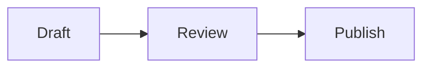

# LessonMark mathematics and diagrams

Status: Accepted for implementation

Target line: 0.2 alpha

Date: 2026-09-07

## 1. Objective

LessonMark shall let authors write formulas and diagrams in the same portable
Markdown source used for the rest of a lesson. Editing Preview, student view,
and saved-content PDF export must treat that source consistently without
rewriting it to generated HTML, SVG, MathML, or LaTeX.

This work extends the existing 0.2 line. It does not alter the published
0.1.0 package or the Moodle Marketplace submission under review.

## 2. Authoring syntax

The syntax intentionally matches Ozeki Markdown Documents so teaching sources
can move between the WordPress and Moodle products without conversion.

### Mermaid

Diagrams use a fenced code block whose language is `mermaid`:

````markdown

````

### Inline formulas

- LaTeX: `` `math:\frac{a}{b}` ``
- LaTeX compatibility alias: `` `latex:\frac{a}{b}` ``
- AsciiMath: `` `asciimath:a/b` ``

The documented canonical LaTeX prefix is `math:`. The `latex:` alias is kept
for compatibility with the WordPress implementation.

### Display formulas

Displayed LaTeX uses a fenced `math` or `latex` block. Displayed AsciiMath uses
a fenced `asciimath` block.

````markdown
```math
\frac{-b \pm \sqrt{b^2 - 4ac}}{2a}
```

```asciimath
sum_(i=1)^n i = (n(n+1))/2
```
````

Ordinary inline code and fenced code retain their current meaning.

## 3. Source and fallback rules

- Exact Markdown remains the only editable source of truth.
- Mermaid SVG, converted LaTeX, KaTeX HTML/MathML, and PDF graphics are derived
  output and are never written back to `markdownsource`.
- Unsupported viewers degrade to readable inline code or fenced code.
- A rendering failure leaves the original source visible and does not block
  the rest of the lesson.
- Import/export preserves syntax without conversion. Backup/restore and course
  duplicate require no new canonical content field.

## 4. Rendering and dependency boundary

- Preview and student view keep using the shared server rendering pipeline.
- The server emits safe code markers; local browser modules replace them with
  disposable rendered output.
- Mermaid, KaTeX, AsciiMath conversion, styles, and fonts are bundled locally.
  No CDN or external rendering service is used.
- Dependencies are pinned, licensed in `thirdpartylibs.xml`, reproducibly
  generated, and checked in release verification.
- Student pages load only the assets their content requires. The editor may
  load both renderers because new syntax can be entered before saving.
- Moodle MathJax is not a dependency and must not double-process markers.

The initial dependency baseline is the reviewed WordPress set: Mermaid
11.17.2, KaTeX 0.18.5, and asciimath-parser 0.6.11. A version change requires
an explicit dependency audit and fixture update.

## 5. Security and limits

- Mermaid uses `securityLevel: strict`, `startOnLoad: false`, disabled HTML
  labels, and explicit text and edge limits.
- KaTeX uses `trust: false`, `strict: error`, `throwOnError: true`, bounded size
  and expansion, and fresh per-formula macro state.
- Initially, at most 100 formulas render per document; each formula is limited
  to 10,000 characters. Mermaid source is limited to 50,000 characters and 500
  edges.
- User content cannot select arbitrary modules, classes, URLs, callbacks, or
  renderer options.
- Rendering is local and transmits no lesson content or personal data.

## 6. Accessibility, responsive display, and PDF

- KaTeX output includes MathML and visual HTML.
- Each rendered formula has a keyboard-operable Copy LaTeX control; touch use
  does not depend on hover.
- Mermaid output is responsive and cannot force the lesson wider than its
  content area.
- Printed pages remain readable. PDF export must include a faithful rendering
  or visibly retain source; silent omission is forbidden.

## 7. Milestones

### M8: Mathematics

Recognise the agreed syntax, bundle KaTeX and AsciiMath locally, render Preview
and student view identically, implement copy and failure behavior, define PDF
fallback, and add localisation plus automated coverage.

Completion: formulas render locally, source round-trips unchanged, failures
remain readable, and existing release gates pass.

### M9: Mermaid diagrams

Recognise Mermaid fences separately from Prism, bundle Mermaid locally, render
with strict security and limits, add responsive/print and failure behavior,
define PDF fallback, and add automated coverage.

Completion: diagrams render locally and safely, ordinary pages avoid the
Mermaid payload, source round-trips unchanged, and release gates pass.

### M10: Release quality and portability

Verify accessibility, touch, narrow-screen, theme, print, malformed input,
conditional assets, import/export, backup/restore, duplicate, and PDF behavior.
Record dependencies and their reproducible build, update public documentation,
run the supported Moodle/PHP matrix, and exercise the upload lifecycle.

Completion: a 0.2 release candidate installs through Moodle's upload UI and
works without network access to a renderer or CDN.

## 8. Acceptance criteria

1. Supported syntax can be created, previewed, saved, imported, and exported
   without canonical-source mutation.
2. Preview and student view share successful and fallback behavior.
3. No external service is contacted for rendering.
4. Malformed input cannot execute trusted HTML or JavaScript or select assets.
5. Ordinary and math-only lessons do not load Mermaid.
6. Formulas expose MathML and keyboard-accessible LaTeX copy.
7. Narrow layouts, print, and PDF do not silently lose content.
8. Existing Markdown, self-check, image, lifecycle, and PDF tests stay green.
9. Third-party code is attributable and reproducible.

## 9. Non-goals

- Visual equation editor or WYSIWYG diagram builder
- Arbitrary HTML in formulas or Mermaid labels
- Hosted diagram or mathematics services
- Persisted generated SVG, HTML, MathML, or converted LaTeX
- Mathematical answer assessment
- Every Mermaid type or TeX package
- Replacing Moodle Quiz, STACK, or other assessment plugins
